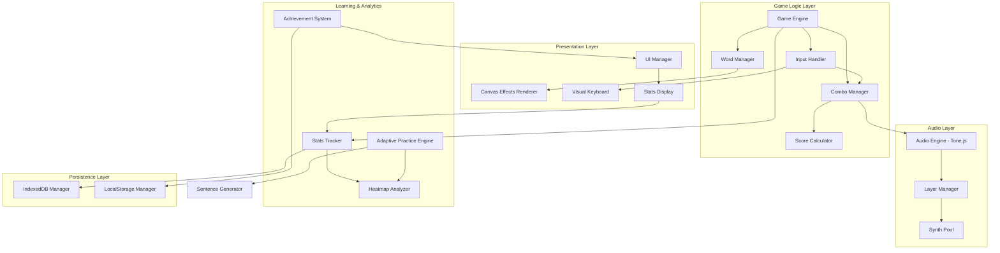
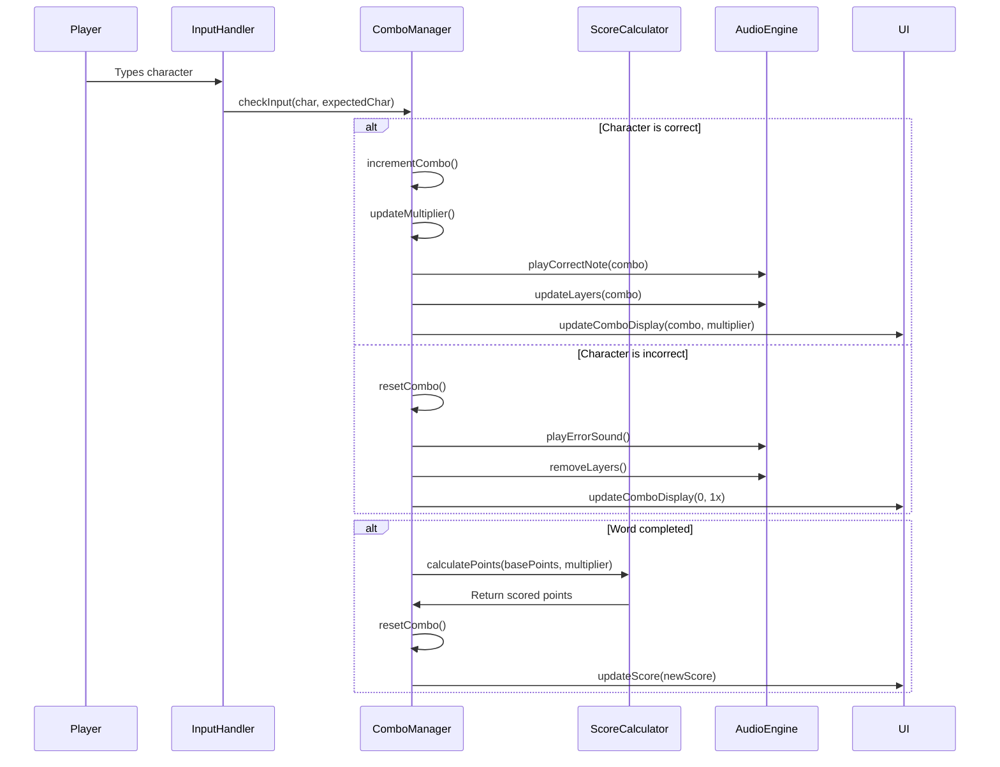
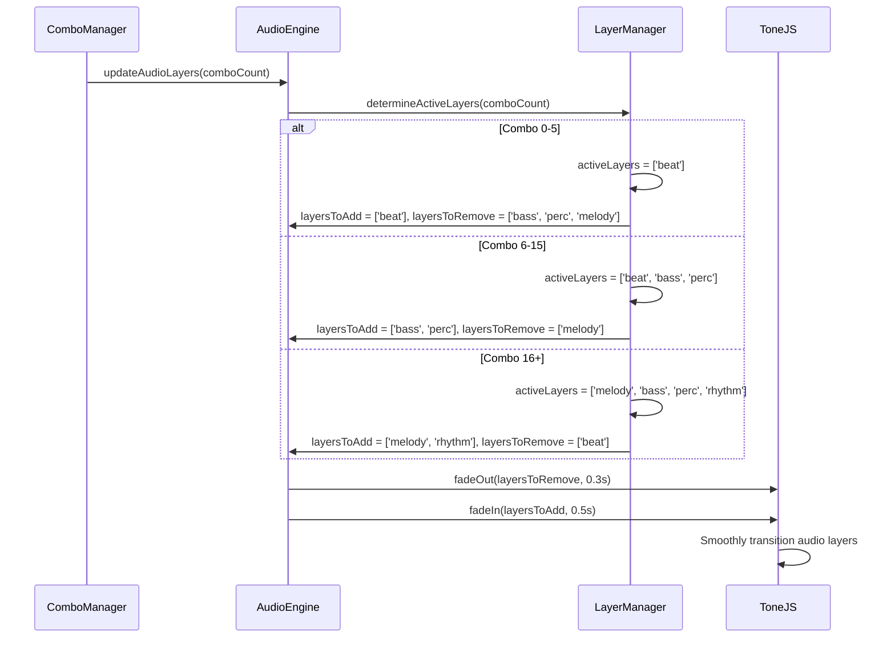
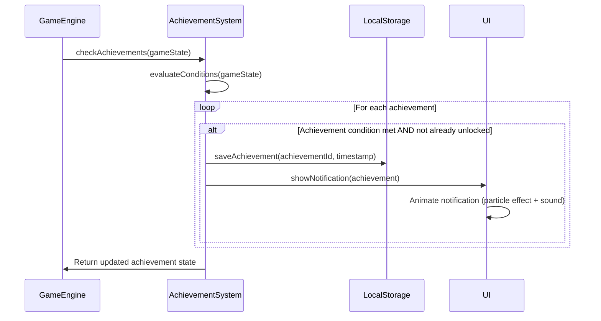
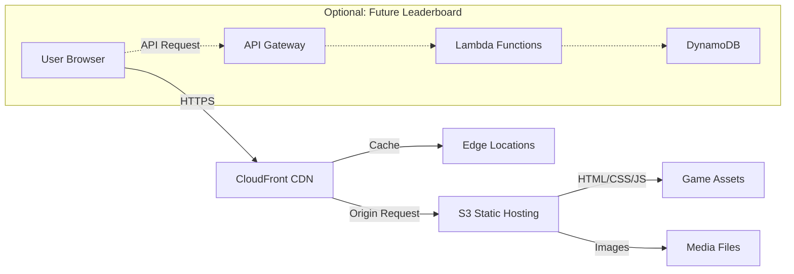

# Design Document: Advanced Typing Game Features

## Overview

This document specifies the technical design for transforming "Type The Keyboard" into an advanced, hackathon-winning web application. The system will leverage modern browser APIs to create an engaging, educational typing experience with generative audio, adaptive learning, visual feedback, and cloud deployment.

### Key Design Principles

1. **Performance First**: Maintain 60 FPS during gameplay with canvas effects and animations
2. **Progressive Enhancement**: Core gameplay works without advanced APIs, enhanced features activate when available
3. **Modular Architecture**: Clear separation of concerns between game logic, audio, visuals, and persistence
4. **Data-Driven**: All gameplay mechanics driven by configuration and player statistics
5. **Browser Compatibility**: Graceful degradation for unsupported APIs

### Technology Stack

- **Core**: Vanilla JavaScript (ES6+), HTML5, CSS3
- **Audio**: Tone.js (v14+) for generative music synthesis
- **Persistence**: IndexedDB for historical data, LocalStorage for achievements
- **Rendering**: HTML5 Canvas API for effects, DOM for game elements
- **Layout Detection**: Keyboard API (experimental) with fallback
- **Deployment**: AWS S3 + CloudFront

## Architecture

### High-Level System Architecture





### Data Flow Diagrams

#### Combo System Flow




#### Audio Adaptation Flow




#### Achievement Unlock Flow



## Components and Interfaces


### 1. ComboManager

**Responsibility**: Tracks consecutive correct keystrokes and manages point multipliers.

**Interface**:
```javascript
class ComboManager {
  constructor(audioEngine, uiManager);
  
  // Core methods
  incrementCombo(): void;
  resetCombo(): void;
  getCurrentCombo(): number;
  getMultiplier(): number;
  
  // Integration methods
  onCorrectInput(char: string): void;
  onIncorrectInput(char: string): void;
  onWordComplete(basePoints: number): number;
  
  // State
  #comboCount: number;
  #multiplier: number;
  #audioEngine: AudioEngine;
  #uiManager: UIManager;
}
```

**Multiplier Calculation Algorithm**:
```javascript
function calculateMultiplier(comboCount) {
  if (comboCount >= 41) return 5;
  if (comboCount >= 26) return 4;
  if (comboCount >= 16) return 3;
  if (comboCount >= 6) return 2;
  return 1;
}
```

**Integration with Existing Code**:
- Hooks into `InputHandler` in `script.js` during character input
- Called before `markWordAsCompleted()` to calculate multiplied points
- Replaces direct score addition with multiplier-adjusted scoring


### 2. AudioEngine (Tone.js Wrapper)

**Responsibility**: Manages dynamic audio synthesis and layer transitions.

**Interface**:
```javascript
class AudioEngine {
  constructor();
  
  // Initialization
  async initialize(): Promise<void>;
  
  // Playback control
  playCorrectNote(combo: number): void;
  playErrorSound(): void;
  playSentenceComplete(): void;
  
  // Layer management
  updateLayers(comboCount: number): void;
  stopAll(): void;
  
  // State
  #context: Tone.Context;
  #activeLayers: Map<string, Layer>;
  #synthPool: SynthPool;
  #isInitialized: boolean;
}

class Layer {
  constructor(name: string, synthConfig: object);
  fadeIn(duration: number): void;
  fadeOut(duration: number): void;
  play(): void;
  stop(): void;
  
  #synth: Tone.Synth | Tone.PolySynth;
  #volume: Tone.Volume;
  #pattern: Tone.Pattern;
}
```


**Audio Layer Configuration**:
```javascript
const AUDIO_LAYERS = {
  beat: {
    synth: { type: 'membrane', volume: -10 },
    pattern: ['C2', null, 'C2', null],
    interval: '8n'
  },
  bass: {
    synth: { type: 'fatsawtooth', volume: -12 },
    pattern: ['C1', 'C1', 'G0', 'G0'],
    interval: '4n'
  },
  percussion: {
    synth: { type: 'metalSynth', volume: -15 },
    pattern: [null, 'C4', null, 'C4'],
    interval: '8n'
  },
  melody: {
    synth: { type: 'synth', volume: -8 },
    pattern: ['C4', 'E4', 'G4', 'B4'],
    interval: '8n'
  },
  rhythm: {
    synth: { type: 'pluckSynth', volume: -10 },
    pattern: ['C3', 'D3', 'E3', 'G3'],
    interval: '16n'
  }
};
```

**Layer Activation Logic**:
```javascript
function determineActiveLayers(comboCount) {
  if (comboCount >= 16) {
    return ['melody', 'bass', 'percussion', 'rhythm'];
  } else if (comboCount >= 6) {
    return ['beat', 'bass', 'percussion'];
  } else {
    return ['beat'];
  }
}
```

**Tone.js Initialization**:
- Must be triggered by user gesture (first keypress or Enter)
- Use `await Tone.start()` before creating synths
- Set global transport tempo: `Tone.Transport.bpm.value = 120`


### 3. KeyboardVisualizer

**Responsibility**: Renders visual keyboard with real-time highlighting and finger position guidance.

**Interface**:
```javascript
class KeyboardVisualizer {
  constructor(containerElement);
  
  // Rendering
  render(layout: KeyboardLayout): void;
  highlightKey(key: string, state: 'expected' | 'correct' | 'incorrect'): void;
  clearHighlights(): void;
  
  // Layout detection
  async detectLayout(): Promise<KeyboardLayout>;
  setLayout(layout: KeyboardLayout): void;
  
  // State
  #container: HTMLElement;
  #keyElements: Map<string, HTMLElement>;
  #currentLayout: KeyboardLayout;
}

// Keyboard layouts
const LAYOUTS = {
  QWERTY_ES: {
    name: 'QWERTY Spanish',
    rows: [
      ['º', '1', '2', '3', '4', '5', '6', '7', '8', '9', '0', "'", '¡'],
      ['q', 'w', 'e', 'r', 't', 'y', 'u', 'i', 'o', 'p', '`', '+'],
      ['a', 's', 'd', 'f', 'g', 'h', 'j', 'k', 'l', 'ñ', '´', 'ç'],
      ['<', 'z', 'x', 'c', 'v', 'b', 'n', 'm', ',', '.', '-']
    ],
    fingerMap: { /* maps key -> finger */ }
  },
  QWERTY_LATAM: {
    name: 'QWERTY Latin American',
    rows: [
      ['|', '1', '2', '3', '4', '5', '6', '7', '8', '9', '0', "'", '¿'],
      ['q', 'w', 'e', 'r', 't', 'y', 'u', 'i', 'o', 'p', '´', '+'],
      ['a', 's', 'd', 'f', 'g', 'h', 'j', 'k', 'l', 'ñ', '{', '}'],
      ['<', 'z', 'x', 'c', 'v', 'b', 'n', 'm', ',', '.', '-']
    ],
    fingerMap: { /* maps key -> finger */ }
  }
};
```


**Finger Position Color Coding**:
```javascript
const FINGER_COLORS = {
  'left-pinky': '#f38ba8',     // Red
  'left-ring': '#fab387',      // Orange
  'left-middle': '#f9e2af',    // Yellow
  'left-index': '#a6e3a1',     // Green
  'thumb': '#89b4fa',          // Blue
  'right-index': '#a6e3a1',    // Green
  'right-middle': '#f9e2af',   // Yellow
  'right-ring': '#fab387',     // Orange
  'right-pinky': '#f38ba8'     // Red
};
```

**Layout Detection Algorithm**:
```javascript
async function detectLayout() {
  // Try Keyboard API (experimental)
  if ('keyboard' in navigator && 'getLayoutMap' in navigator.keyboard) {
    try {
      const layoutMap = await navigator.keyboard.getLayoutMap();
      
      // Check for Spanish-specific keys
      if (layoutMap.get('Semicolon') === 'ñ') {
        return layoutMap.has('Backquote') && layoutMap.get('Backquote') === 'º' 
          ? LAYOUTS.QWERTY_ES 
          : LAYOUTS.QWERTY_LATAM;
      }
    } catch (error) {
      console.warn('Keyboard API failed:', error);
    }
  }
  
  // Fallback to QWERTY Spanish
  return LAYOUTS.QWERTY_ES;
}
```

**CSS Structure** (add to styles.css):
```css
.visual-keyboard {
  display: flex;
  flex-direction: column;
  gap: 0.3rem;
  padding: 1rem;
  background: #181825;
  border-radius: 12px;
  margin: 1rem 0;
}

.keyboard-row {
  display: flex;
  gap: 0.3rem;
  justify-content: center;
}

.key {
  min-width: 2.5rem;
  height: 2.5rem;
  display: flex;
  align-items: center;
  justify-content: center;
  background: #313244;
  border: 1px solid #45475a;
  border-radius: 4px;
  font-size: 0.9rem;
  transition: all 0.15s;
}

.key.expected {
  border-color: var(--finger-color);
  box-shadow: 0 0 10px var(--finger-color);
}

.key.correct {
  background: #a6e3a1;
  color: #1e1e2e;
}

.key.incorrect {
  background: #f38ba8;
  color: #1e1e2e;
}
```


### 4. StatsTracker

**Responsibility**: Persists gameplay data and provides historical analytics.

**Interface**:
```javascript
class StatsTracker {
  constructor();
  
  // Session management
  async initialize(): Promise<void>;
  async saveSession(sessionData: SessionData): Promise<void>;
  async getAllSessions(): Promise<SessionData[]>;
  
  // Analytics
  async getHistoricalAccuracy(): Promise<number[]>;
  async getProblematicKeys(): Promise<Map<string, number>>;
  async getTopDifficultWords(): Promise<Array<{word: string, errors: number}>>;
  async getOverallStats(): Promise<OverallStats>;
  
  // Real-time tracking
  trackKeyError(key: string): void;
  trackWordError(word: string): void;
  
  // State
  #db: IDBDatabase;
  #currentSession: SessionData;
}

interface SessionData {
  id: string;
  timestamp: number;
  wpm: number;
  accuracy: number;
  totalWords: number;
  correctWords: number;
  missedWords: number;
  duration: number;
  highestCombo: number;
  keyErrors: Map<string, number>;
  wordErrors: Map<string, number>;
  wpmHistory: Array<{time: number, wpm: number}>;
}

interface OverallStats {
  totalSessions: number;
  totalWords: number;
  totalTime: number;
  bestWpm: number;
  bestCombo: number;
  averageAccuracy: number;
}
```


**IndexedDB Schema**:
```javascript
const DB_NAME = 'TypeKeyboardDB';
const DB_VERSION = 1;

// Object stores
const STORES = {
  sessions: {
    keyPath: 'id',
    indexes: [
      { name: 'timestamp', keyPath: 'timestamp' },
      { name: 'wpm', keyPath: 'wpm' }
    ]
  },
  keyErrors: {
    keyPath: 'key',
    // Stores: { key: string, count: number, lastUpdated: number }
  },
  wordErrors: {
    keyPath: 'word',
    // Stores: { word: string, count: number, lastUpdated: number }
  }
};

// Initialization
function initDatabase() {
  return new Promise((resolve, reject) => {
    const request = indexedDB.open(DB_NAME, DB_VERSION);
    
    request.onupgradeneeded = (event) => {
      const db = event.target.result;
      
      // Create sessions store
      const sessionsStore = db.createObjectStore('sessions', { keyPath: 'id' });
      sessionsStore.createIndex('timestamp', 'timestamp', { unique: false });
      sessionsStore.createIndex('wpm', 'wpm', { unique: false });
      
      // Create key errors store
      db.createObjectStore('keyErrors', { keyPath: 'key' });
      
      // Create word errors store
      db.createObjectStore('wordErrors', { keyPath: 'word' });
    };
    
    request.onsuccess = () => resolve(request.result);
    request.onerror = () => reject(request.error);
  });
}
```

**Real-time WPM Calculation**:
```javascript
class WPMCalculator {
  constructor() {
    this.history = [];
    this.windowSize = 5000; // 5 second window
  }
  
  addWord(timestamp) {
    this.history.push(timestamp);
    // Remove entries older than window
    const cutoff = timestamp - this.windowSize;
    this.history = this.history.filter(t => t >= cutoff);
  }
  
  getCurrentWPM() {
    if (this.history.length < 2) return 0;
    
    const timeSpan = this.history[this.history.length - 1] - this.history[0];
    const wordsInWindow = this.history.length - 1;
    const minutes = timeSpan / 60000;
    
    return Math.round(wordsInWindow / minutes);
  }
}
```


### 5. AchievementSystem

**Responsibility**: Tracks milestone progress and unlocks achievements.

**Interface**:
```javascript
class AchievementSystem {
  constructor(notificationManager);
  
  // Core methods
  async initialize(): Promise<void>;
  checkAchievements(gameState: GameState): Achievement[];
  async unlockAchievement(achievementId: string): Promise<void>;
  getProgress(achievementId: string): number;
  
  // Query methods
  getAllAchievements(): Achievement[];
  getUnlockedAchievements(): Achievement[];
  getLockedAchievements(): Achievement[];
  
  // State
  #achievements: Map<string, Achievement>;
  #unlockedIds: Set<string>;
  #progressTrackers: Map<string, number>;
}

interface Achievement {
  id: string;
  name: string;
  description: string;
  icon: string;
  condition: (gameState: GameState) => boolean;
  progressFn?: (gameState: GameState) => number;
  maxProgress?: number;
}
```

**Achievement Definitions**:
```javascript
const ACHIEVEMENTS = [
  {
    id: 'novato',
    name: 'Novato',
    description: 'Escribe 100 palabras',
    icon: '🌱',
    condition: (state) => state.totalWords >= 100,
    progressFn: (state) => state.totalWords,
    maxProgress: 100
  },
  {
    id: 'mecanografo',
    name: 'Mecanógrafo',
    description: 'Escribe 500 palabras con 80% de precisión promedio',
    icon: '⌨️',
    condition: (state) => state.totalWords >= 500 && state.averageAccuracy >= 80,
    progressFn: (state) => Math.min(state.totalWords, 500) + (state.averageAccuracy >= 80 ? 500 : 0),
    maxProgress: 1000
  },
  {
    id: 'combo-master',
    name: 'Combo Master',
    description: 'Alcanza un combo de 30 o más',
    icon: '🔥',
    condition: (state) => state.highestCombo >= 30,
    progressFn: (state) => state.highestCombo,
    maxProgress: 30
  },
  {
    id: 'perfeccionista',
    name: 'Perfeccionista',
    description: 'Completa una oración con 100% de precisión',
    icon: '💎',
    condition: (state) => state.hasPerfectSentence,
    progressFn: (state) => state.hasPerfectSentence ? 1 : 0,
    maxProgress: 1
  }
];
```


**LocalStorage Structure**:
```javascript
// Key: 'achievements'
{
  unlocked: ['novato', 'combo-master'],
  progress: {
    'novato': 100,
    'mecanografo': 350,
    'combo-master': 30,
    'perfeccionista': 0
  },
  timestamps: {
    'novato': 1704567890123,
    'combo-master': 1704568912456
  }
}
```

**Achievement Evaluation Algorithm**:
```javascript
function evaluateAchievements(gameState) {
  const newlyUnlocked = [];
  
  for (const achievement of ACHIEVEMENTS) {
    // Skip already unlocked
    if (this.#unlockedIds.has(achievement.id)) continue;
    
    // Update progress
    if (achievement.progressFn) {
      const progress = achievement.progressFn(gameState);
      this.#progressTrackers.set(achievement.id, progress);
    }
    
    // Check condition
    if (achievement.condition(gameState)) {
      newlyUnlocked.push(achievement);
      this.unlockAchievement(achievement.id);
    }
  }
  
  return newlyUnlocked;
}
```

**Notification Display**:
```css
.achievement-notification {
  position: fixed;
  top: 5rem;
  right: 2rem;
  background: linear-gradient(135deg, #89b4fa 0%, #cba6f7 100%);
  color: #1e1e2e;
  padding: 1rem 1.5rem;
  border-radius: 12px;
  box-shadow: 0 8px 30px rgba(0, 0, 0, 0.5);
  animation: slideInRight 0.5s ease, slideOutRight 0.5s ease 3s forwards;
  z-index: 1000;
}

@keyframes slideInRight {
  from { transform: translateX(400px); opacity: 0; }
  to { transform: translateX(0); opacity: 1; }
}
```


### 6. AdaptivePracticeEngine

**Responsibility**: Analyzes player weaknesses and generates targeted practice content.

**Interface**:
```javascript
class AdaptivePracticeEngine {
  constructor(statsTracker, sentenceGenerator);
  
  // Analysis
  async identifyProblematicKeys(threshold: number = 3): Promise<string[]>;
  async generatePracticeSentences(count: number = 5): Promise<string[]>;
  
  // Practice session
  async startPracticeMode(): Promise<void>;
  trackImprovement(key: string): void;
  isKeyImproved(key: string): boolean;
  
  // State
  #statsTracker: StatsTracker;
  #sentenceGen: SentenceGenerator;
  #problematicKeys: Set<string>;
  #improvementCounters: Map<string, number>;
}
```

**Problematic Key Identification**:
```javascript
async function identifyProblematicKeys(threshold = 3) {
  const keyErrors = await this.#statsTracker.getProblematicKeys();
  
  // Sort keys by error count
  const sortedKeys = Array.from(keyErrors.entries())
    .sort((a, b) => b[1] - a[1]);
  
  // Get keys above threshold
  const problematic = sortedKeys
    .filter(([key, count]) => count >= threshold)
    .map(([key]) => key);
  
  return problematic.slice(0, 10); // Top 10 problematic keys
}
```

**Sentence Generation Algorithm**:
```javascript
class SentenceGenerator {
  constructor(vocabulary) {
    this.vocabulary = vocabulary; // Spanish word bank
    this.templates = [
      ['article', 'noun', 'verb', 'preposition', 'article', 'noun'],
      ['article', 'adjective', 'noun', 'verb', 'adverb'],
      ['noun', 'verb', 'article', 'noun', 'adjective']
    ];
  }
  
  generate(targetKeys, count = 5) {
    const sentences = [];
    
    for (let i = 0; i < count; i++) {
      const template = this.randomTemplate();
      const words = this.fillTemplate(template, targetKeys);
      sentences.push(words.join(' ') + '.');
    }
    
    return sentences;
  }
  
  fillTemplate(template, targetKeys) {
    return template.map(partOfSpeech => {
      // Filter vocabulary by part of speech
      const candidates = this.vocabulary[partOfSpeech];
      
      // Prefer words containing target keys
      const withTargetKeys = candidates.filter(word => 
        targetKeys.some(key => word.includes(key))
      );
      
      const pool = withTargetKeys.length > 0 ? withTargetKeys : candidates;
      return pool[Math.floor(Math.random() * pool.length)];
    });
  }
  
  randomTemplate() {
    return this.templates[Math.floor(Math.random() * this.templates.length)];
  }
}
```


**Spanish Vocabulary Bank** (minimal example):
```javascript
const SPANISH_VOCABULARY = {
  article: ['el', 'la', 'los', 'las', 'un', 'una'],
  noun: ['gato', 'perro', 'casa', 'árbol', 'niño', 'mesa', 'libro', 'flor'],
  verb: ['corre', 'salta', 'lee', 'escribe', 'canta', 'baila', 'come'],
  adjective: ['grande', 'pequeño', 'rápido', 'lento', 'feliz', 'triste'],
  preposition: ['en', 'sobre', 'bajo', 'con', 'sin', 'para'],
  adverb: ['rápidamente', 'lentamente', 'bien', 'mal', 'siempre']
};
```

**Improvement Tracking**:
```javascript
function trackImprovement(key) {
  if (!this.#improvementCounters.has(key)) {
    this.#improvementCounters.set(key, 0);
  }
  
  const count = this.#improvementCounters.get(key) + 1;
  this.#improvementCounters.set(key, count);
  
  // Mark as improved after 5 consecutive correct
  if (count >= 5) {
    this.#problematicKeys.delete(key);
    this.#improvementCounters.delete(key);
  }
}

// Reset counter on error
function onKeyError(key) {
  this.#improvementCounters.set(key, 0);
}
```

**Practice Mode UI Changes**:
- Words do not fall (WORD_SPEED = 0)
- Show finger position tip below keyboard
- Display improvement progress bar for each problematic key
- No time limit
- No score multiplier


### 7. CanvasEffectsRenderer

**Responsibility**: Renders high-performance visual effects using Canvas API.

**Interface**:
```javascript
class CanvasEffectsRenderer {
  constructor(canvasElement);
  
  // Effect triggers
  particleExplosion(x: number, y: number, color: string): void;
  neonTrail(x: number, y: number, previousX: number, previousY: number): void;
  screenShake(intensity: number, duration: number): void;
  comboFire(x: number, y: number): void;
  
  // Animation loop
  start(): void;
  stop(): void;
  update(deltaTime: number): void;
  
  // State
  #canvas: HTMLCanvasElement;
  #ctx: CanvasRenderingContext2D;
  #particles: Particle[];
  #trails: Trail[];
  #shake: ShakeEffect;
  #animationId: number;
}

class Particle {
  constructor(x, y, vx, vy, color, lifetime);
  update(dt: number): boolean; // Returns false when dead
  render(ctx: CanvasRenderingContext2D): void;
}

class Trail {
  constructor(points, color, fadeSpeed);
  update(dt: number): boolean;
  render(ctx: CanvasRenderingContext2D): void;
}
```


**Particle Explosion Algorithm**:
```javascript
function particleExplosion(x, y, color) {
  const particleCount = 30;
  
  for (let i = 0; i < particleCount; i++) {
    const angle = (Math.PI * 2 * i) / particleCount;
    const speed = 2 + Math.random() * 3;
    const vx = Math.cos(angle) * speed;
    const vy = Math.sin(angle) * speed;
    const lifetime = 0.5 + Math.random() * 0.5; // 0.5-1s
    
    this.#particles.push(new Particle(x, y, vx, vy, color, lifetime));
  }
}

class Particle {
  constructor(x, y, vx, vy, color, lifetime) {
    this.x = x;
    this.y = y;
    this.vx = vx;
    this.vy = vy;
    this.color = color;
    this.lifetime = lifetime;
    this.age = 0;
    this.size = 3 + Math.random() * 2;
  }
  
  update(dt) {
    this.age += dt;
    if (this.age >= this.lifetime) return false;
    
    this.x += this.vx;
    this.y += this.vy;
    this.vy += 0.2; // Gravity
    
    return true;
  }
  
  render(ctx) {
    const alpha = 1 - (this.age / this.lifetime);
    ctx.globalAlpha = alpha;
    ctx.fillStyle = this.color;
    ctx.beginPath();
    ctx.arc(this.x, this.y, this.size, 0, Math.PI * 2);
    ctx.fill();
    ctx.globalAlpha = 1;
  }
}
```


**Neon Trail Algorithm**:
```javascript
class Trail {
  constructor(points, color, fadeSpeed = 0.03) {
    this.points = points; // Array of {x, y}
    this.color = color;
    this.fadeSpeed = fadeSpeed;
    this.alpha = 1.0;
  }
  
  update(dt) {
    this.alpha -= this.fadeSpeed;
    return this.alpha > 0;
  }
  
  render(ctx) {
    if (this.points.length < 2) return;
    
    ctx.globalAlpha = this.alpha;
    ctx.strokeStyle = this.color;
    ctx.lineWidth = 3;
    ctx.shadowBlur = 10;
    ctx.shadowColor = this.color;
    
    ctx.beginPath();
    ctx.moveTo(this.points[0].x, this.points[0].y);
    
    for (let i = 1; i < this.points.length; i++) {
      ctx.lineTo(this.points[i].x, this.points[i].y);
    }
    
    ctx.stroke();
    ctx.globalAlpha = 1;
    ctx.shadowBlur = 0;
  }
}

// Usage: track word positions every frame
function trackWordTrails() {
  wordStates.forEach((state, index) => {
    if (!state.trailHistory) state.trailHistory = [];
    
    state.trailHistory.push({ x: state.x, y: state.y });
    
    // Keep last 10 positions
    if (state.trailHistory.length > 10) {
      state.trailHistory.shift();
    }
    
    // Create trail every 5 frames
    if (index % 5 === 0 && state.trailHistory.length > 1) {
      canvasEffects.neonTrail([...state.trailHistory], '#89b4fa');
    }
  });
}
```

**Screen Shake Algorithm**:
```javascript
class ShakeEffect {
  constructor() {
    this.intensity = 0;
    this.duration = 0;
    this.elapsed = 0;
  }
  
  start(intensity, duration) {
    this.intensity = intensity;
    this.duration = duration;
    this.elapsed = 0;
  }
  
  update(dt) {
    if (this.elapsed >= this.duration) {
      this.intensity = 0;
      return { x: 0, y: 0 };
    }
    
    this.elapsed += dt;
    
    const progress = this.elapsed / this.duration;
    const currentIntensity = this.intensity * (1 - progress);
    
    return {
      x: (Math.random() - 0.5) * currentIntensity * 2,
      y: (Math.random() - 0.5) * currentIntensity * 2
    };
  }
}

// Apply shake to container
function applyShake() {
  const offset = this.#shake.update(deltaTime);
  gameContainer.style.transform = `translate(${offset.x}px, ${offset.y}px)`;
}
```


**Combo Fire Animation**:
```javascript
function comboFire(x, y) {
  // Create continuous fire particles
  setInterval(() => {
    if (currentCombo < 21) return; // Only for combo 21+
    
    for (let i = 0; i < 3; i++) {
      const offsetX = (Math.random() - 0.5) * 20;
      const particle = new Particle(
        x + offsetX,
        y,
        0,
        -2 - Math.random(), // Upward
        ['#f38ba8', '#fab387', '#f9e2af'][Math.floor(Math.random() * 3)],
        0.8
      );
      this.#particles.push(particle);
    }
  }, 50);
}
```

**Performance Optimization**:
```javascript
// Use offscreen canvas for pre-rendering
const offscreenCanvas = document.createElement('canvas');
const offscreenCtx = offscreenCanvas.getContext('2d');

// Batch draw calls
function render() {
  // Clear
  ctx.clearRect(0, 0, canvas.width, canvas.height);
  
  // Render all particles in one batch
  ctx.save();
  particles.forEach(p => p.render(ctx));
  ctx.restore();
  
  // Render all trails in one batch
  ctx.save();
  trails.forEach(t => t.render(ctx));
  ctx.restore();
}

// Limit particle count
const MAX_PARTICLES = 500;
if (particles.length > MAX_PARTICLES) {
  particles = particles.slice(-MAX_PARTICLES);
}
```

**Canvas Layer Setup**:
```html
<!-- Add to index.html -->
<canvas id="effectsCanvas" style="position: absolute; top: 0; left: 0; pointer-events: none; z-index: 10;"></canvas>
```


### 8. FullscreenManager

**Responsibility**: Manages fullscreen mode with browser compatibility.

**Interface**:
```javascript
class FullscreenManager {
  constructor(targetElement);
  
  // Core methods
  async enterFullscreen(): Promise<boolean>;
  async exitFullscreen(): Promise<void>;
  toggleFullscreen(): Promise<void>;
  
  // State queries
  isFullscreenSupported(): boolean;
  isCurrentlyFullscreen(): boolean;
  
  // Event handlers
  onFullscreenChange(callback: Function): void;
  
  // State
  #element: HTMLElement;
  #listeners: Set<Function>;
}
```

**Fullscreen API Implementation with Vendor Prefixes**:
```javascript
class FullscreenManager {
  constructor(targetElement) {
    this.#element = targetElement;
    this.#listeners = new Set();
    this.#setupListeners();
  }
  
  isFullscreenSupported() {
    return !!(
      document.fullscreenEnabled ||
      document.webkitFullscreenEnabled ||
      document.mozFullScreenEnabled ||
      document.msFullscreenEnabled
    );
  }
  
  async enterFullscreen() {
    if (!this.isFullscreenSupported()) {
      console.warn('Fullscreen API not supported');
      return false;
    }
    
    try {
      const element = this.#element;
      
      if (element.requestFullscreen) {
        await element.requestFullscreen();
      } else if (element.webkitRequestFullscreen) {
        await element.webkitRequestFullscreen();
      } else if (element.mozRequestFullScreen) {
        await element.mozRequestFullScreen();
      } else if (element.msRequestFullscreen) {
        await element.msRequestFullscreen();
      }
      
      return true;
    } catch (error) {
      console.error('Fullscreen request failed:', error);
      return false;
    }
  }
  
  async exitFullscreen() {
    if (document.exitFullscreen) {
      await document.exitFullscreen();
    } else if (document.webkitExitFullscreen) {
      await document.webkitExitFullscreen();
    } else if (document.mozCancelFullScreen) {
      await document.mozCancelFullScreen();
    } else if (document.msExitFullscreen) {
      await document.msExitFullscreen();
    }
  }
  
  isCurrentlyFullscreen() {
    return !!(
      document.fullscreenElement ||
      document.webkitFullscreenElement ||
      document.mozFullScreenElement ||
      document.msFullscreenElement
    );
  }
  
  #setupListeners() {
    const events = [
      'fullscreenchange',
      'webkitfullscreenchange',
      'mozfullscreenchange',
      'MSFullscreenChange'
    ];
    
    events.forEach(event => {
      document.addEventListener(event, () => {
        this.#listeners.forEach(callback => callback(this.isCurrentlyFullscreen()));
      });
    });
  }
}
```


**UI Integration**:
```html
<!-- Add to menu screen -->
<button class="fullscreen-toggle" id="fullscreenBtn" onclick="toggleFullscreen()">
  <span id="fullscreenIcon">🖥️</span>
  <span id="fullscreenText">Pantalla completa</span>
</button>
```

```css
.fullscreen-toggle {
  margin-top: 1rem;
  background: #313244;
  border: 1px solid #45475a;
  color: #cdd6f4;
  font-family: inherit;
  font-size: 0.85rem;
  padding: 0.6rem 1.2rem;
  border-radius: 8px;
  cursor: pointer;
  transition: all 0.2s;
  display: flex;
  align-items: center;
  gap: 0.5rem;
}

.fullscreen-toggle:hover {
  border-color: #89b4fa;
  background: #45475a;
}

.fullscreen-toggle:disabled {
  opacity: 0.5;
  cursor: not-allowed;
}
```

```javascript
// Initialize on page load
window.addEventListener('load', () => {
  const fullscreenMgr = new FullscreenManager(document.documentElement);
  const btn = document.getElementById('fullscreenBtn');
  
  if (!fullscreenMgr.isFullscreenSupported()) {
    btn.disabled = true;
    btn.title = 'Tu navegador no soporta pantalla completa';
  }
  
  fullscreenMgr.onFullscreenChange((isFullscreen) => {
    document.getElementById('fullscreenIcon').textContent = isFullscreen ? '🗗' : '🖥️';
    document.getElementById('fullscreenText').textContent = 
      isFullscreen ? 'Salir de pantalla completa' : 'Pantalla completa';
  });
});
```

## Data Models


### IndexedDB Schema

```typescript
// Database: TypeKeyboardDB (version 1)

interface Session {
  id: string;                    // UUID
  timestamp: number;             // Unix timestamp
  wpm: number;                   // Words per minute
  accuracy: number;              // Percentage 0-100
  totalWords: number;            // Words attempted
  correctWords: number;          // Words typed correctly
  missedWords: number;           // Words missed
  duration: number;              // Session duration in seconds
  highestCombo: number;          // Max combo reached
  difficulty: 'easy' | 'medium' | 'hard';
  language: 'es' | 'en';
  keyErrors: {                   // Map stored as array
    key: string,
    count: number
  }[];
  wordErrors: {
    word: string,
    count: number
  }[];
  wpmHistory: {                  // Real-time WPM samples
    time: number,
    wpm: number
  }[];
  sentencesCompleted: number;
  perfectSentences: number;      // Sentences with 100% accuracy
}

interface KeyError {
  key: string;                   // Primary key
  count: number;                 // Total errors across all sessions
  lastUpdated: number;           // Unix timestamp
  sessions: string[];            // Session IDs where error occurred
}

interface WordError {
  word: string;                  // Primary key
  count: number;                 // Total errors
  lastUpdated: number;
  averageAttempts: number;       // Average attempts to type correctly
}
```

### LocalStorage Schema

```typescript
// Key: 'achievements'
interface AchievementsData {
  unlocked: string[];            // Achievement IDs
  progress: {
    [achievementId: string]: number
  };
  timestamps: {
    [achievementId: string]: number  // When unlocked
  };
}

// Key: 'gameSettings'
interface GameSettings {
  soundEnabled: boolean;
  soundVolume: number;           // 0-1
  showKeyboard: boolean;
  difficulty: 'easy' | 'medium' | 'hard';
  language: 'es' | 'en';
  keyboardLayout: 'QWERTY_ES' | 'QWERTY_LATAM';
}

// Key: 'practiceProgress'
interface PracticeProgress {
  improvedKeys: string[];
  lastPracticeSession: number;   // Unix timestamp
  totalPracticeTime: number;     // Seconds
}
```


### Game State Model

```typescript
interface GameState {
  // Session state
  active: boolean;
  startTime: number;
  endTime: number | null;
  mode: 'normal' | 'practice';
  
  // Combo state
  currentCombo: number;
  highestCombo: number;
  multiplier: number;
  
  // Scoring
  score: number;
  correctWords: number;
  missedWords: number;
  totalCharacters: number;
  correctCharacters: number;
  
  // Sentences
  sentencesCompleted: number;
  perfectSentences: number;
  currentSentenceErrors: number;
  
  // Real-time metrics
  currentWPM: number;
  currentAccuracy: number;
  wpmHistory: Array<{time: number, wpm: number}>;
  
  // Input tracking
  currentWordIndex: number;
  currentTypedText: string;
  keyErrorsThisSession: Map<string, number>;
  wordErrorsThisSession: Map<string, number>;
  
  // Audio state
  audioInitialized: boolean;
  activeLayers: string[];
  
  // Visual state
  canvasEffects: {
    particles: Particle[],
    trails: Trail[],
    shake: ShakeEffect | null
  };
}
```

## Error Handling


### Error Handling Strategy

#### 1. Audio Initialization Failures

**Problem**: Tone.js requires user gesture to start audio context.

**Solution**:
```javascript
class AudioEngine {
  async initialize() {
    try {
      await Tone.start();
      this.#isInitialized = true;
      console.log('Audio context started');
    } catch (error) {
      console.error('Failed to start audio:', error);
      this.#isInitialized = false;
      // Show user notification
      showNotification('Audio deshabilitado. Haz clic para habilitar.', 'warning');
    }
  }
  
  // Graceful degradation
  playNote(note) {
    if (!this.#isInitialized) {
      console.warn('Audio not initialized, skipping playback');
      return;
    }
    // ... play note
  }
}
```

#### 2. IndexedDB Failures

**Problem**: IndexedDB may be unavailable (private browsing, storage quota exceeded).

**Solution**:
```javascript
class StatsTracker {
  async initialize() {
    try {
      this.#db = await initDatabase();
      this.#fallbackMode = false;
    } catch (error) {
      console.error('IndexedDB unavailable:', error);
      this.#fallbackMode = true;
      this.#memoryStore = new Map(); // In-memory fallback
      showNotification('Estadísticas no se guardarán permanentemente', 'warning');
    }
  }
  
  async saveSession(data) {
    if (this.#fallbackMode) {
      this.#memoryStore.set(data.id, data);
      return;
    }
    
    try {
      await this.#db.put('sessions', data);
    } catch (error) {
      console.error('Failed to save session:', error);
      // Fallback to localStorage
      try {
        localStorage.setItem(`session_${data.id}`, JSON.stringify(data));
      } catch (lsError) {
        console.error('LocalStorage also failed:', lsError);
      }
    }
  }
}
```


#### 3. Keyboard API Unavailability

**Problem**: Keyboard API is experimental and not widely supported.

**Solution**:
```javascript
class KeyboardVisualizer {
  async detectLayout() {
    try {
      if (!('keyboard' in navigator)) {
        throw new Error('Keyboard API not supported');
      }
      
      const layoutMap = await navigator.keyboard.getLayoutMap();
      return this.#inferLayoutFromMap(layoutMap);
    } catch (error) {
      console.warn('Keyboard API unavailable, using default:', error);
      return LAYOUTS.QWERTY_ES; // Safe default
    }
  }
}
```

#### 4. Fullscreen API Rejection

**Problem**: User may deny fullscreen permission or API unavailable.

**Solution**:
```javascript
async function toggleFullscreen() {
  try {
    if (fullscreenMgr.isCurrentlyFullscreen()) {
      await fullscreenMgr.exitFullscreen();
    } else {
      const success = await fullscreenMgr.enterFullscreen();
      
      if (!success) {
        showNotification('No se pudo entrar en modo pantalla completa', 'error');
      }
    }
  } catch (error) {
    console.error('Fullscreen toggle failed:', error);
    showNotification('Tu navegador bloqueó el modo pantalla completa', 'error');
  }
}
```

#### 5. Canvas Performance Issues

**Problem**: Too many particles may cause FPS drops.

**Solution**:
```javascript
class CanvasEffectsRenderer {
  update(deltaTime) {
    // Measure FPS
    this.#fps = 1000 / deltaTime;
    
    // Adaptive quality
    if (this.#fps < 50) {
      this.#reduceQuality();
    } else if (this.#fps > 58 && this.#qualityLevel < this.#maxQuality) {
      this.#increaseQuality();
    }
    
    // Limit particle count
    if (this.#particles.length > this.#maxParticles) {
      this.#particles = this.#particles.slice(-this.#maxParticles);
    }
  }
  
  #reduceQuality() {
    this.#maxParticles = Math.max(100, this.#maxParticles - 50);
    console.log('Reduced particle limit to', this.#maxParticles);
  }
}
```


#### 6. Sentence Generator Edge Cases

**Problem**: Generated sentences may be grammatically incorrect or nonsensical.

**Solution**:
```javascript
class SentenceGenerator {
  generate(targetKeys, count) {
    const sentences = [];
    let attempts = 0;
    
    while (sentences.length < count && attempts < count * 3) {
      attempts++;
      const sentence = this.#generateOne(targetKeys);
      
      // Validate sentence
      if (this.#isValid(sentence)) {
        sentences.push(sentence);
      }
    }
    
    // Fallback to default sentences if generation fails
    if (sentences.length === 0) {
      console.warn('Generation failed, using fallback');
      return DEFAULT_SENTENCES.slice(0, count);
    }
    
    return sentences;
  }
  
  #isValid(sentence) {
    const words = sentence.split(' ');
    // Check word count
    if (words.length < 5 || words.length > 15) return false;
    // Check for duplicates
    if (new Set(words).size !== words.length) return false;
    return true;
  }
}

const DEFAULT_SENTENCES = [
  'el gato negro salta sobre el muro alto',
  'la luna brilla en el cielo nocturno estrellado',
  'los niños juegan felices en el parque verde'
];
```

## Testing Strategy


### Testing Approach

This feature involves **UI rendering, IaC-like configuration (AWS), side effects (audio playback, database writes), and browser API integration**. Property-based testing is **NOT appropriate** for these components.

**Testing Strategy**:
- **Unit Tests**: Example-based tests for business logic (combo calculation, multiplier logic, sentence validation)
- **Integration Tests**: Manual verification of browser APIs (Keyboard API, Fullscreen API)
- **Mock-Based Tests**: Audio playback verification, IndexedDB operations
- **Snapshot Tests**: UI component rendering (keyboard layout, achievement notifications)
- **End-to-End Tests**: Full gameplay session with user simulation

### Unit Test Coverage

**1. ComboManager Logic**
```javascript
describe('ComboManager', () => {
  it('should calculate correct multiplier for combo ranges', () => {
    const combo = new ComboManager(mockAudio, mockUI);
    
    expect(combo.getMultiplier(5)).toBe(1);
    expect(combo.getMultiplier(6)).toBe(2);
    expect(combo.getMultiplier(16)).toBe(3);
    expect(combo.getMultiplier(26)).toBe(4);
    expect(combo.getMultiplier(41)).toBe(5);
  });
  
  it('should reset combo on incorrect input', () => {
    const combo = new ComboManager(mockAudio, mockUI);
    combo.incrementCombo();
    combo.incrementCombo();
    expect(combo.getCurrentCombo()).toBe(2);
    
    combo.resetCombo();
    expect(combo.getCurrentCombo()).toBe(0);
    expect(combo.getMultiplier()).toBe(1);
  });
  
  it('should calculate points with multiplier on word complete', () => {
    const combo = new ComboManager(mockAudio, mockUI);
    for (let i = 0; i < 20; i++) combo.incrementCombo();
    
    const points = combo.onWordComplete(10); // Base points = 10
    expect(points).toBe(30); // 10 * 3x multiplier
  });
});
```


**2. Sentence Generator Validation**
```javascript
describe('SentenceGenerator', () => {
  it('should generate valid sentences with target keys', () => {
    const gen = new SentenceGenerator(SPANISH_VOCABULARY);
    const sentences = gen.generate(['a', 'e', 'i'], 3);
    
    expect(sentences).toHaveLength(3);
    sentences.forEach(s => {
      const words = s.split(' ');
      expect(words.length).toBeGreaterThanOrEqual(5);
      expect(words.length).toBeLessThanOrEqual(15);
      
      // Check target keys present
      const hasTargetKey = ['a', 'e', 'i'].some(key => s.includes(key));
      expect(hasTargetKey).toBe(true);
    });
  });
  
  it('should fallback to default sentences on generation failure', () => {
    const gen = new SentenceGenerator({}); // Empty vocabulary
    const sentences = gen.generate(['x', 'y', 'z'], 3);
    
    expect(sentences).toHaveLength(3);
    expect(sentences).toEqual(DEFAULT_SENTENCES.slice(0, 3));
  });
});
```

**3. Achievement Evaluation**
```javascript
describe('AchievementSystem', () => {
  it('should unlock Novato achievement at 100 words', () => {
    const system = new AchievementSystem(mockNotifier);
    const gameState = { totalWords: 100, averageAccuracy: 75, highestCombo: 10 };
    
    const unlocked = system.checkAchievements(gameState);
    expect(unlocked).toContainEqual(expect.objectContaining({ id: 'novato' }));
  });
  
  it('should not unlock Mecanografo without accuracy requirement', () => {
    const system = new AchievementSystem(mockNotifier);
    const gameState = { totalWords: 500, averageAccuracy: 70, highestCombo: 10 };
    
    const unlocked = system.checkAchievements(gameState);
    expect(unlocked).not.toContainEqual(expect.objectContaining({ id: 'mecanografo' }));
  });
});
```


### Mock-Based Tests

**4. AudioEngine Playback**
```javascript
describe('AudioEngine', () => {
  it('should initialize Tone.js context', async () => {
    const mockTone = { start: jest.fn().mockResolvedValue(undefined) };
    global.Tone = mockTone;
    
    const audio = new AudioEngine();
    await audio.initialize();
    
    expect(mockTone.start).toHaveBeenCalled();
  });
  
  it('should add layers based on combo count', () => {
    const audio = new AudioEngine();
    const spy = jest.spyOn(audio, 'updateLayers');
    
    audio.updateLayers(5);
    expect(audio.getActiveLayers()).toEqual(['beat']);
    
    audio.updateLayers(10);
    expect(audio.getActiveLayers()).toEqual(['beat', 'bass', 'percussion']);
    
    audio.updateLayers(20);
    expect(audio.getActiveLayers()).toEqual(['melody', 'bass', 'percussion', 'rhythm']);
  });
});
```

**5. IndexedDB Operations**
```javascript
describe('StatsTracker', () => {
  let db;
  
  beforeEach(async () => {
    // Use fake-indexeddb for testing
    db = await initTestDatabase();
  });
  
  it('should save session data to IndexedDB', async () => {
    const tracker = new StatsTracker();
    await tracker.initialize();
    
    const sessionData = {
      id: 'test-123',
      timestamp: Date.now(),
      wpm: 45,
      accuracy: 92,
      // ... other fields
    };
    
    await tracker.saveSession(sessionData);
    const retrieved = await tracker.getSession('test-123');
    
    expect(retrieved).toEqual(sessionData);
  });
});
```


### Manual Integration Tests

**6. Keyboard API Detection**
- Test in Chrome 69+ with experimental features enabled
- Verify fallback to QWERTY_ES in Firefox/Safari
- Confirm layout detection for Spanish vs Latin American keyboards

**7. Fullscreen API**
- Test fullscreen toggle in supported browsers (Chrome, Firefox, Edge)
- Verify graceful degradation in Safari iOS
- Test ESC key exit behavior

**8. Canvas Performance**
- Monitor FPS with Chrome DevTools Performance tab
- Verify 60 FPS maintained with 300+ particles
- Test adaptive quality reduction on low-end devices

**9. Audio Synchronization**
- Verify audio layer transitions are smooth (no clicks/pops)
- Test correct note playback with high typing speed
- Confirm graceful degradation when audio context fails

### End-to-End Test Scenario

```javascript
describe('Full Gameplay Session', () => {
  it('should complete a typing session with all features', async () => {
    // 1. Load game
    await page.goto('http://localhost:8080');
    
    // 2. Select difficulty
    await page.click('.difficulty-card.medium');
    
    // 3. Start game
    await page.keyboard.press('Enter');
    
    // 4. Type several words correctly (build combo)
    const words = ['el', 'gato', 'negro', 'salta'];
    for (const word of words) {
      await page.keyboard.type(word);
      await page.keyboard.press('Space');
    }
    
    // 5. Verify combo incremented
    const combo = await page.$eval('#liveCombo', el => el.textContent);
    expect(parseInt(combo)).toBeGreaterThan(0);
    
    // 6. Make an error
    await page.keyboard.type('wronggg');
    
    // 7. Verify combo reset
    const resetCombo = await page.$eval('#liveCombo', el => el.textContent);
    expect(parseInt(resetCombo)).toBe(0);
    
    // 8. Complete game
    await page.waitForSelector('.results.active', { timeout: 30000 });
    
    // 9. Verify results displayed
    const score = await page.$eval('#resultScore', el => el.textContent);
    expect(parseInt(score)).toBeGreaterThan(0);
  });
});
```


## AWS Deployment Architecture

### Infrastructure Overview



### S3 Configuration

**Bucket Setup**:
```bash
# Create S3 bucket
aws s3 mb s3://type-the-keyboard-game --region us-east-1

# Enable static website hosting
aws s3 website s3://type-the-keyboard-game \
  --index-document index.html \
  --error-document index.html
```

**Bucket Policy** (public read access):
```json
{
  "Version": "2012-10-17",
  "Statement": [
    {
      "Sid": "PublicReadGetObject",
      "Effect": "Allow",
      "Principal": "*",
      "Action": "s3:GetObject",
      "Resource": "arn:aws:s3:::type-the-keyboard-game/*"
    }
  ]
}
```

**File Structure in S3**:
```
type-the-keyboard-game/
├── index.html
├── script.js
├── styles.css
├── lib/
│   └── tone.js
├── img/
│   ├── img-easy.png
│   ├── img-medium.png
│   ├── img-hard.png
│   └── img-Bomb.png
└── assets/
    └── achievements/
        ├── novato.png
        ├── mecanografo.png
        ├── combo-master.png
        └── perfeccionista.png
```


### CloudFront Configuration

**Distribution Setup**:
```bash
# Create CloudFront distribution via AWS CLI
aws cloudfront create-distribution --origin-domain-name type-the-keyboard-game.s3.amazonaws.com \
  --default-root-object index.html \
  --viewer-protocol-policy redirect-to-https
```

**CloudFront Configuration JSON**:
```json
{
  "Origins": [
    {
      "Id": "S3-type-the-keyboard-game",
      "DomainName": "type-the-keyboard-game.s3.amazonaws.com",
      "S3OriginConfig": {
        "OriginAccessIdentity": ""
      }
    }
  ],
  "DefaultCacheBehavior": {
    "TargetOriginId": "S3-type-the-keyboard-game",
    "ViewerProtocolPolicy": "redirect-to-https",
    "AllowedMethods": ["GET", "HEAD", "OPTIONS"],
    "CachedMethods": ["GET", "HEAD"],
    "ForwardedValues": {
      "QueryString": false,
      "Cookies": {
        "Forward": "none"
      }
    },
    "MinTTL": 0,
    "DefaultTTL": 86400,
    "MaxTTL": 31536000,
    "Compress": true
  },
  "PriceClass": "PriceClass_100",
  "Enabled": true
}
```

**Cache Invalidation** (after updates):
```bash
# Invalidate CloudFront cache
aws cloudfront create-invalidation \
  --distribution-id E1234567890ABC \
  --paths "/*"
```


### Deployment Script

**deploy.sh**:
```bash
#!/bin/bash

# Variables
BUCKET_NAME="type-the-keyboard-game"
DISTRIBUTION_ID="E1234567890ABC"
REGION="us-east-1"

echo "Starting deployment to S3..."

# Sync files to S3
aws s3 sync . s3://$BUCKET_NAME \
  --exclude ".git/*" \
  --exclude ".kiro/*" \
  --exclude "*.md" \
  --exclude "deploy.sh" \
  --region $REGION \
  --delete

# Set cache headers
echo "Setting cache headers..."

# Cache HTML for 1 hour
aws s3 cp s3://$BUCKET_NAME/index.html s3://$BUCKET_NAME/index.html \
  --metadata-directive REPLACE \
  --cache-control "max-age=3600" \
  --content-type "text/html"

# Cache JS/CSS for 1 year (with versioning)
aws s3 cp s3://$BUCKET_NAME/script.js s3://$BUCKET_NAME/script.js \
  --metadata-directive REPLACE \
  --cache-control "max-age=31536000" \
  --content-type "application/javascript"

aws s3 cp s3://$BUCKET_NAME/styles.css s3://$BUCKET_NAME/styles.css \
  --metadata-directive REPLACE \
  --cache-control "max-age=31536000" \
  --content-type "text/css"

# Invalidate CloudFront cache
echo "Invalidating CloudFront cache..."
aws cloudfront create-invalidation \
  --distribution-id $DISTRIBUTION_ID \
  --paths "/*"

echo "Deployment complete!"
echo "Game URL: https://$DISTRIBUTION_ID.cloudfront.net"
```

**CI/CD Integration** (GitHub Actions):
```yaml
name: Deploy to AWS

on:
  push:
    branches:
      - main

jobs:
  deploy:
    runs-on: ubuntu-latest
    steps:
      - name: Checkout code
        uses: actions/checkout@v3
      
      - name: Configure AWS credentials
        uses: aws-actions/configure-aws-credentials@v2
        with:
          aws-access-key-id: ${{ secrets.AWS_ACCESS_KEY_ID }}
          aws-secret-access-key: ${{ secrets.AWS_SECRET_ACCESS_KEY }}
          aws-region: us-east-1
      
      - name: Deploy to S3
        run: |
          chmod +x deploy.sh
          ./deploy.sh
```


### Optional: Leaderboard Backend (Future Enhancement)

**DynamoDB Table Schema**:
```javascript
{
  TableName: "TypeKeyboardLeaderboard",
  KeySchema: [
    { AttributeName: "difficulty", KeyType: "HASH" },  // Partition key
    { AttributeName: "score", KeyType: "RANGE" }       // Sort key
  ],
  AttributeDefinitions: [
    { AttributeName: "difficulty", AttributeType: "S" },
    { AttributeName: "score", AttributeType: "N" },
    { AttributeName: "timestamp", AttributeType: "N" }
  ],
  GlobalSecondaryIndexes: [
    {
      IndexName: "TimestampIndex",
      KeySchema: [
        { AttributeName: "difficulty", KeyType: "HASH" },
        { AttributeName: "timestamp", KeyType: "RANGE" }
      ],
      Projection: { ProjectionType: "ALL" }
    }
  ],
  BillingMode: "PAY_PER_REQUEST"
}
```

**Lambda Function** (submit score):
```javascript
const AWS = require('aws-sdk');
const dynamodb = new AWS.DynamoDB.DocumentClient();

exports.handler = async (event) => {
  const { difficulty, playerName, score, wpm, accuracy } = JSON.parse(event.body);
  
  // Validate input
  if (!difficulty || !playerName || !score) {
    return {
      statusCode: 400,
      body: JSON.stringify({ error: 'Missing required fields' })
    };
  }
  
  // Save to DynamoDB
  await dynamodb.put({
    TableName: 'TypeKeyboardLeaderboard',
    Item: {
      difficulty,
      score,
      playerName,
      wpm,
      accuracy,
      timestamp: Date.now()
    }
  }).promise();
  
  return {
    statusCode: 200,
    headers: {
      'Access-Control-Allow-Origin': '*',
      'Content-Type': 'application/json'
    },
    body: JSON.stringify({ success: true })
  };
};
```

**API Gateway Configuration**:
```
POST /api/leaderboard/submit
GET /api/leaderboard/{difficulty}?limit=10
```


## Implementation Phases

### Phase 1: MVP (Core Features) - 8-10 hours

**Priority**: Must-have features for playable demo

1. **Combo System** (2 hours)
   - Implement ComboManager class
   - Integrate with existing input handler
   - Add UI display for combo counter and multiplier
   - Update scoring logic

2. **Audio System** (3 hours)
   - Initialize Tone.js
   - Implement AudioEngine with layer management
   - Create base audio layers (beat, bass, percussion, melody)
   - Wire up correct/incorrect sound triggers

3. **Visual Keyboard** (3 hours)
   - Render keyboard layout (QWERTY ES/LATAM)
   - Implement key highlighting
   - Integrate with input handler
   - Add finger position color coding

**Deliverable**: Playable game with combo system, dynamic audio, and visual keyboard

### Phase 2: Analytics & Progress - 6-8 hours

**Priority**: High - Adds retention and educational value

4. **Stats Dashboard** (4 hours)
   - Initialize IndexedDB schema
   - Implement StatsTracker class
   - Build dashboard UI
   - Add real-time WPM graph
   - Generate heatmap visualization

5. **Achievement System** (2 hours)
   - Define achievements and conditions
   - Implement AchievementSystem class
   - Create unlock notification UI
   - Store progress in LocalStorage

**Deliverable**: Persistent player progress tracking and achievement system


### Phase 3: Polish & Effects - 6-8 hours

**Priority**: Medium-High - Adds "wow factor" for hackathon judges

6. **Adaptive Practice Mode** (3 hours)
   - Implement SentenceGenerator
   - Build AdaptivePracticeEngine
   - Create practice mode UI
   - Add improvement tracking

7. **Canvas Effects** (3 hours)
   - Initialize CanvasEffectsRenderer
   - Implement particle system
   - Add neon trails
   - Create screen shake effect
   - Add combo fire animation

8. **Fullscreen Mode** (1 hour)
   - Implement FullscreenManager
   - Add toggle button
   - Handle browser compatibility

**Deliverable**: Polished game with visual effects and adaptive learning

### Phase 4: Deployment - 2-3 hours

**Priority**: High - Required for judges/users to access

9. **AWS Deployment** (2 hours)
   - Configure S3 bucket
   - Set up CloudFront distribution
   - Deploy static assets
   - Test production URL

10. **Optional: Leaderboard** (4-6 hours if time permits)
    - Create DynamoDB table
    - Implement Lambda function
    - Configure API Gateway
    - Add leaderboard UI

**Deliverable**: Live production deployment with public URL


## Integration with Existing Code

### Modifying script.js

**Key Integration Points**:

1. **Initialize all systems on page load**:
```javascript
// Add at top of script.js
let comboManager;
let audioEngine;
let keyboardVisualizer;
let statsTracker;
let achievementSystem;
let adaptivePracticeEngine;
let canvasEffects;
let fullscreenManager;

window.addEventListener('load', async () => {
  // Initialize managers
  audioEngine = new AudioEngine();
  comboManager = new ComboManager(audioEngine, updateUI);
  keyboardVisualizer = new KeyboardVisualizer(document.getElementById('visualKeyboard'));
  statsTracker = new StatsTracker();
  achievementSystem = new AchievementSystem(showNotification);
  canvasEffects = new CanvasEffectsRenderer(document.getElementById('effectsCanvas'));
  fullscreenManager = new FullscreenManager(document.documentElement);
  
  // Initialize async components
  await statsTracker.initialize();
  await achievementSystem.initialize();
  
  // Detect keyboard layout
  const layout = await keyboardVisualizer.detectLayout();
  keyboardVisualizer.render(layout);
  
  // Show menu
  menuScreen.style.display = '';
});
```

2. **Hook into startGame()**:
```javascript
function startGame() {
  if (gameActive) return;
  
  gameActive = true;
  gameStartTime = Date.now();
  startHint.classList.add('hidden');
  statsBar.classList.add('visible');
  
  // Initialize audio (requires user gesture)
  audioEngine.initialize().catch(console.error);
  
  // Reset combo
  comboManager.resetCombo();
  
  // Start canvas effects
  canvasEffects.start();
  
  // Show all words
  wordStates.forEach(state => {
    if (state.element) state.element.style.visibility = 'visible';
  });
  
  // Start animation loop
  animate();
}
```


3. **Hook into input handler**:
```javascript
document.addEventListener('keydown', function (e) {
  if (!gameActive) {
    if (e.key === 'Enter') startGame();
    return;
  }
  
  // ... existing code ...
  
  // Handle character input
  if (e.key.length === 1) {
    const currentWord = words[currentWordIndex];
    const isCorrect = currentTypedText.length < currentWord.length && 
                      e.key === currentWord[currentTypedText.length];
    
    if (isCorrect) {
      // Correct input
      comboManager.incrementCombo();
      audioEngine.playCorrectNote(comboManager.getCurrentCombo());
      keyboardVisualizer.highlightKey(e.key, 'correct');
    } else {
      // Incorrect input
      comboManager.resetCombo();
      audioEngine.playErrorSound();
      canvasEffects.screenShake(5, 200);
      keyboardVisualizer.highlightKey(e.key, 'incorrect');
      
      // Track error
      statsTracker.trackKeyError(e.key);
    }
    
    currentTypedText += e.key;
    updateWordDisplay(currentWordIndex);
    
    // Update audio layers
    audioEngine.updateLayers(comboManager.getCurrentCombo());
    
    // Highlight next expected key
    if (currentTypedText.length < currentWord.length) {
      keyboardVisualizer.highlightKey(currentWord[currentTypedText.length], 'expected');
    }
    
    // Auto-complete check
    if (currentTypedText === currentWord) {
      markWordAsCompleted(currentWordIndex);
    }
  }
});
```


4. **Update markWordAsCompleted()**:
```javascript
function markWordAsCompleted(index) {
  const state = wordStates[index];
  if (state.status === 'completed') return;
  
  state.status = 'completed';
  correctWords++;
  
  // Calculate points with multiplier
  const basePoints = POINTS_PER_WORD;
  const multipliedPoints = comboManager.onWordComplete(basePoints);
  totalScore += multipliedPoints;
  
  // Particle explosion at word position
  const rect = state.element.getBoundingClientRect();
  canvasEffects.particleExplosion(rect.left + rect.width/2, rect.top, '#a6e3a1');
  
  // Add word to accumulated area
  addWordToAccumulated(words[index]);
  
  // Check for sentence completion
  if (words[index].endsWith('.')) {
    audioEngine.playSentenceComplete();
    completedSentences++;
  }
  
  // Visual success effect
  if (state.element) {
    state.element.style.display = 'none';
  }
  
  // Move to next word
  currentWordIndex++;
  currentTypedText = '';
  
  // Highlight next word
  if (currentWordIndex < words.length) {
    const nextState = wordStates[currentWordIndex];
    if (nextState.element) {
      nextState.element.style.color = '#89b4fa';
    }
    
    // Highlight first key of next word
    keyboardVisualizer.highlightKey(words[currentWordIndex][0], 'expected');
  }
}
```


5. **Update animate() loop**:
```javascript
function animate() {
  if (!gameActive) return;
  
  const now = Date.now();
  const deltaTime = now - (lastFrameTime || now);
  lastFrameTime = now;
  
  // Update word positions
  let allWordsFinished = true;
  
  wordStates.forEach((state, index) => {
    if (state.status === 'pending' || state.status === 'active') {
      state.y += WORD_SPEED;
      allWordsFinished = false;
      
      // Track trail history
      if (!state.trailHistory) state.trailHistory = [];
      state.trailHistory.push({ x: state.element.offsetLeft, y: state.y });
      if (state.trailHistory.length > 10) state.trailHistory.shift();
      
      // Create neon trail
      if (state.trailHistory.length > 1) {
        canvasEffects.neonTrail([...state.trailHistory], '#89b4fa');
      }
      
      // Check if word reached hit line
      if (state.y >= HIT_LINE_Y) {
        if (index === currentWordIndex) {
          markWordAsMissed(index);
        } else {
          state.status = 'missed';
          missedWords++;
          if (state.element) state.element.style.display = 'none';
        }
        return;
      }
      
      // Update visual position
      if (state.element) {
        state.element.style.top = state.y + 'px';
      }
    }
  });
  
  // Update canvas effects
  canvasEffects.update(deltaTime);
  
  // Update live stats
  updateLiveStats();
  
  // Check for game completion
  if (allWordsFinished && currentWordIndex >= words.length) {
    endGame();
    return;
  }
  
  // Continue animation
  animationFrameId = requestAnimationFrame(animate);
}
```


6. **Update endGame()**:
```javascript
async function endGame() {
  gameActive = false;
  if (animationFrameId) {
    cancelAnimationFrame(animationFrameId);
    animationFrameId = null;
  }
  
  // Stop audio and effects
  audioEngine.stopAll();
  canvasEffects.stop();
  
  // Calculate session data
  const sessionData = {
    id: `session-${Date.now()}`,
    timestamp: Date.now(),
    wpm: parseInt(liveWpm.textContent),
    accuracy: parseInt(liveAcc.textContent),
    totalWords: correctWords + missedWords,
    correctWords,
    missedWords,
    duration: Math.floor((Date.now() - gameStartTime) / 1000),
    highestCombo: comboManager.getHighestCombo(),
    difficulty: currentDifficulty,
    language: currentLanguage,
    keyErrors: Array.from(statsTracker.getCurrentKeyErrors()),
    wordErrors: Array.from(statsTracker.getCurrentWordErrors()),
    wpmHistory: statsTracker.getWPMHistory(),
    sentencesCompleted: completedSentences,
    perfectSentences: statsTracker.getPerfectSentences()
  };
  
  // Save to IndexedDB
  await statsTracker.saveSession(sessionData);
  
  // Check achievements
  const gameState = {
    totalWords: await statsTracker.getTotalWords(),
    averageAccuracy: await statsTracker.getAverageAccuracy(),
    highestCombo: sessionData.highestCombo,
    hasPerfectSentence: sessionData.perfectSentences > 0
  };
  
  const unlockedAchievements = await achievementSystem.checkAchievements(gameState);
  
  // Show unlock notifications
  unlockedAchievements.forEach(achievement => {
    setTimeout(() => {
      showAchievementNotification(achievement);
    }, 1000);
  });
  
  // Hide game elements
  statsBar.classList.remove('visible');
  textDisplay.style.display = 'none';
  
  // Show results
  document.getElementById('resultScore').textContent = totalScore;
  document.getElementById('resultSentences').textContent = completedSentences;
  document.getElementById('resultWords').textContent = correctWords;
  document.getElementById('resultMissed').textContent = missedWords;
  
  resultsDiv.classList.add('active');
}
```


### Modifying index.html

**Add new UI elements**:

```html
<!-- Add after stats-bar -->
<div class="combo-display" id="comboDisplay">
  <div class="combo-counter">
    <span class="combo-value" id="comboValue">0</span>
    <span class="combo-label">combo</span>
  </div>
  <div class="multiplier">
    <span class="multiplier-value" id="multiplierValue">1x</span>
  </div>
</div>

<!-- Add visual keyboard before text-display -->
<div class="visual-keyboard" id="visualKeyboard">
  <!-- Keyboard will be rendered here by KeyboardVisualizer -->
</div>

<!-- Add canvas for effects -->
<canvas id="effectsCanvas" width="1920" height="1080"></canvas>

<!-- Add stats dashboard (new page) -->
<div class="stats-dashboard" id="statsDashboard" style="display: none;">
  <h2>Estadísticas</h2>
  
  <div class="overall-stats">
    <div class="stat-card">
      <span class="stat-value" id="totalWords">0</span>
      <span class="stat-label">Palabras totales</span>
    </div>
    <div class="stat-card">
      <span class="stat-value" id="totalTime">0</span>
      <span class="stat-label">Tiempo jugado (min)</span>
    </div>
    <div class="stat-card">
      <span class="stat-value" id="bestWpm">0</span>
      <span class="stat-label">Mejor WPM</span>
    </div>
    <div class="stat-card">
      <span class="stat-value" id="bestCombo">0</span>
      <span class="stat-label">Mejor combo</span>
    </div>
  </div>
  
  <div class="accuracy-chart">
    <canvas id="accuracyChart"></canvas>
  </div>
  
  <div class="heatmap-container">
    <h3>Teclas problemáticas</h3>
    <div id="keyboardHeatmap"></div>
  </div>
  
  <div class="achievements-container">
    <h3>Logros</h3>
    <div id="achievementsList"></div>
  </div>
  
  <button class="back-btn" onclick="showMenu()">Volver al menú</button>
</div>
```


### Modifying styles.css

**Add new styles**:

```css
/* Combo display */
.combo-display {
  position: fixed;
  top: 50%;
  right: 2rem;
  transform: translateY(-50%);
  display: flex;
  flex-direction: column;
  align-items: center;
  gap: 1rem;
  z-index: 20;
}

.combo-counter {
  display: flex;
  flex-direction: column;
  align-items: center;
  padding: 1rem;
  background: rgba(49, 50, 68, 0.8);
  border: 2px solid #89b4fa;
  border-radius: 12px;
  min-width: 80px;
}

.combo-value {
  font-size: 2.5rem;
  font-weight: 700;
  color: #89b4fa;
  line-height: 1;
}

.combo-label {
  font-size: 0.7rem;
  color: #585b70;
  text-transform: uppercase;
  margin-top: 0.3rem;
}

.multiplier-value {
  font-size: 1.5rem;
  font-weight: 700;
  color: #f9e2af;
  padding: 0.5rem 1rem;
  background: rgba(249, 226, 175, 0.1);
  border-radius: 8px;
}

/* Combo fire effect (for combo 21+) */
.combo-counter.on-fire {
  animation: fireGlow 0.5s ease-in-out infinite alternate;
}

@keyframes fireGlow {
  from {
    box-shadow: 0 0 20px rgba(243, 139, 168, 0.5);
  }
  to {
    box-shadow: 0 0 40px rgba(243, 139, 168, 0.8), 0 0 60px rgba(251, 179, 135, 0.6);
  }
}

/* Canvas effects */
#effectsCanvas {
  position: fixed;
  top: 0;
  left: 0;
  width: 100vw;
  height: 100vh;
  pointer-events: none;
  z-index: 5;
}
```


## Performance Considerations

### Maintaining 60 FPS

**Critical Optimizations**:

1. **Particle System Limits**:
   - Max 500 particles on screen
   - Remove dead particles immediately
   - Use object pooling for particle reuse
   - Batch canvas draw calls

2. **Canvas Layer Separation**:
   - Main game canvas (words, UI)
   - Effects canvas (particles, trails)
   - Static background canvas
   - Only redraw changed regions

3. **Audio Synthesis**:
   - Limit active synths to 5 concurrent
   - Pre-create synth pool on initialization
   - Reuse synth instances
   - Use Tone.js volume ramping instead of creating new nodes

4. **DOM Manipulation**:
   - Use `transform` instead of `top/left` for positioning
   - Batch style changes
   - Use `requestAnimationFrame` for animations
   - Minimize reflows and repaints

5. **IndexedDB Operations**:
   - Queue writes to avoid blocking main thread
   - Use transactions for batch operations
   - Implement debouncing for frequent updates
   - Read asynchronously on separate frame

**Performance Monitoring**:
```javascript
class PerformanceMonitor {
  constructor() {
    this.frameTimes = [];
    this.lastFrameTime = performance.now();
  }
  
  update() {
    const now = performance.now();
    const frameTime = now - this.lastFrameTime;
    this.frameTimes.push(frameTime);
    
    // Keep last 60 frames
    if (this.frameTimes.length > 60) {
      this.frameTimes.shift();
    }
    
    this.lastFrameTime = now;
  }
  
  getFPS() {
    const avgFrameTime = this.frameTimes.reduce((a, b) => a + b, 0) / this.frameTimes.length;
    return Math.round(1000 / avgFrameTime);
  }
  
  checkPerformance() {
    const fps = this.getFPS();
    
    if (fps < 50) {
      console.warn('Performance degradation detected:', fps, 'FPS');
      // Trigger quality reduction
      return 'low';
    } else if (fps >= 58) {
      return 'high';
    }
    return 'medium';
  }
}
```


## Browser Compatibility

### Feature Support Matrix

| Feature | Chrome 100+ | Firefox 100+ | Safari 15+ | Edge 100+ |
|---------|-------------|--------------|------------|-----------|
| Tone.js Web Audio | ✅ Full | ✅ Full | ✅ Full | ✅ Full |
| IndexedDB | ✅ Full | ✅ Full | ✅ Full | ✅ Full |
| LocalStorage | ✅ Full | ✅ Full | ✅ Full | ✅ Full |
| Canvas API | ✅ Full | ✅ Full | ✅ Full | ✅ Full |
| Fullscreen API | ✅ Full | ✅ Full | ⚠️ Limited | ✅ Full |
| Keyboard API | ⚠️ Experimental | ❌ None | ❌ None | ⚠️ Experimental |
| requestAnimationFrame | ✅ Full | ✅ Full | ✅ Full | ✅ Full |

✅ = Full support  
⚠️ = Partial support or experimental  
❌ = No support

### Polyfills and Fallbacks

**1. Keyboard API**:
```javascript
// Always fallback to default layout
const DEFAULT_LAYOUT = LAYOUTS.QWERTY_ES;

async function detectLayout() {
  if (!('keyboard' in navigator)) {
    console.log('Keyboard API not supported, using default');
    return DEFAULT_LAYOUT;
  }
  // ... detection logic
}
```

**2. Fullscreen API**:
```javascript
// Handle vendor prefixes
function requestFullscreen(element) {
  if (element.requestFullscreen) {
    return element.requestFullscreen();
  } else if (element.webkitRequestFullscreen) {
    return element.webkitRequestFullscreen();
  } else if (element.mozRequestFullScreen) {
    return element.mozRequestFullScreen();
  } else if (element.msRequestFullscreen) {
    return element.msRequestFullscreen();
  }
  throw new Error('Fullscreen not supported');
}
```

**3. Web Audio Context**:
```javascript
// Tone.js handles vendor prefixes internally
// Just ensure user gesture requirement
window.AudioContext = window.AudioContext || window.webkitAudioContext;
```


### Mobile Considerations

**Touch Support** (future enhancement):
```javascript
// Detect mobile
const isMobile = /Android|webOS|iPhone|iPad|iPod/i.test(navigator.userAgent);

if (isMobile) {
  // Show on-screen keyboard permanently
  keyboardVisualizer.setMode('touch');
  
  // Disable falling words (too difficult on mobile)
  WORD_SPEED = 0;
  
  // Enable tap-to-type on visual keyboard
  document.querySelectorAll('.key').forEach(key => {
    key.addEventListener('touchstart', (e) => {
      e.preventDefault();
      simulateKeyPress(key.dataset.key);
    });
  });
}
```

**Responsive Layout**:
```css
@media (max-width: 768px) {
  .combo-display {
    right: 1rem;
    scale: 0.8;
  }
  
  .visual-keyboard {
    scale: 0.7;
  }
  
  .text-display {
    font-size: 1.2rem;
  }
  
  #effectsCanvas {
    /* Reduce particle count on mobile */
    --max-particles: 200;
  }
}
```

## Security Considerations

### Content Security Policy

**Recommended CSP Headers** (for S3/CloudFront):
```html
<meta http-equiv="Content-Security-Policy" 
  content="default-src 'self'; 
           script-src 'self' 'unsafe-inline' https://cdn.jsdelivr.net; 
           style-src 'self' 'unsafe-inline'; 
           img-src 'self' data:; 
           font-src 'self' data:; 
           connect-src 'self' https://*.amazonaws.com;">
```

### Data Privacy

- **LocalStorage**: Only stores achievement progress (no PII)
- **IndexedDB**: Only stores gameplay statistics (no PII)
- **No cookies**: No tracking or analytics cookies
- **No external APIs**: Fully client-side (except optional leaderboard)


## Summary

This design document provides a comprehensive technical blueprint for implementing advanced features in the "Type The Keyboard" game. The modular architecture ensures maintainability, the performance optimizations guarantee 60 FPS gameplay, and the progressive enhancement approach ensures broad browser compatibility.

### Key Technical Decisions

1. **Modular Architecture**: Clear separation between game logic, audio, visuals, and persistence enables parallel development and easy testing
2. **Vanilla JavaScript**: No framework dependencies keep bundle size small and deployment simple
3. **Progressive Enhancement**: Core gameplay works everywhere, enhanced features activate when available
4. **Performance-First**: Canvas effects, audio synthesis, and database operations optimized for 60 FPS
5. **Browser Compatibility**: Graceful degradation ensures accessibility across modern browsers

### Implementation Roadmap

- **Phase 1 (MVP)**: 8-10 hours - Combo system, audio, visual keyboard
- **Phase 2 (Analytics)**: 6-8 hours - Stats dashboard, achievements
- **Phase 3 (Polish)**: 6-8 hours - Adaptive practice, canvas effects, fullscreen
- **Phase 4 (Deployment)**: 2-3 hours - AWS S3 + CloudFront

**Total Estimated Time**: 22-29 hours for complete implementation

### Success Criteria

- ✅ Maintains 60 FPS with all effects enabled
- ✅ Audio responds smoothly to player actions
- ✅ Visual keyboard provides accurate finger guidance
- ✅ Statistics persist across sessions
- ✅ Achievements unlock naturally during gameplay
- ✅ Adaptive practice identifies and targets weak points
- ✅ Deployed and accessible via public URL

**Next Steps**: Begin implementation with Phase 1 (MVP) focusing on combo system and audio integration.

